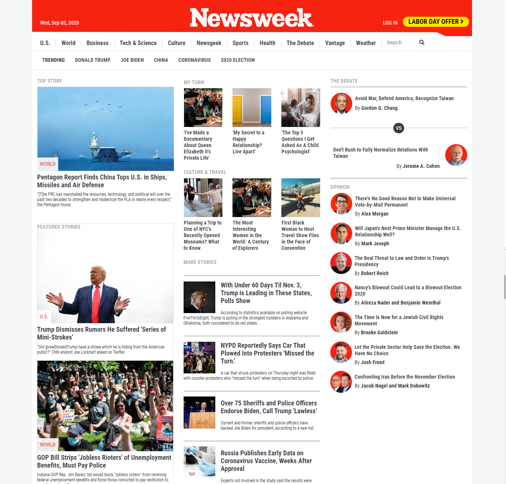

# The Next Web Page - Responsive design

> Seventh training project on Microverse HMTL/CSS curriculum done with Bootstrap [Newsweek Web Page](https://www.newsweek.com/)

## Built With

- HTML
- CSS
- Flexbox
- Float
- Bootstrap

## Live Demo

[Live Demo Link](https://raw.githack.com/janis-jenny/Newsweek-Clone-Page/Newsweek/INDEX.html)

## Author

👤 **Jenny Cardenas**

- Github: [@janis-jenny](https://github.com/janis-jenny)
- Twitter: [@janis_jenny](https://twitter.com/janis_jenny)
- Linkedin: [linkedin](https://www.linkedin.com/in/paolajenny)

👤 **Kevin Cotrina**

- Github: [@kcotrinam92y](https://github.com/kcotrinam92)
- Twitter: [@KevinCot12](https://twitter.com/KevinCot12)
- Linkedin: [linkedin](https://www.linkedin.com/in/kevin-cotrina-6208b7149/
)

## 🤝 Contributing

Contributions, issues and feature requests are welcome!

Feel free to check the [issues page](https://github.com/janis-jenny/Newsweek-Clone-Page/issues/1).

## Show your support

Give a ⭐️ if you like this project!

## 📝 License

This project is [MIT](https://opensource.org/licenses/MIT) licensed.